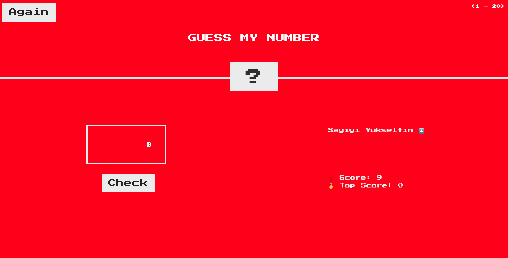

# JS-NumberGuess
Number Guess 
 * Between 1-20, the computer keeps a random number and the user tries to find this number.
 * You have only 10 chances to find the correct number.
 * If you get the number wrong, the background color will be red.
 * If you get the number right, the background color will be green and you will hear the applause.
 * If you cannot find the answer within 10 chances, you will hear the wrong sound.
 * Top score is saved in memory.
 * Viel Spaß beim Raten :)
 * 
Main Screen :

When the number is wrong :

When you want to play the game again

